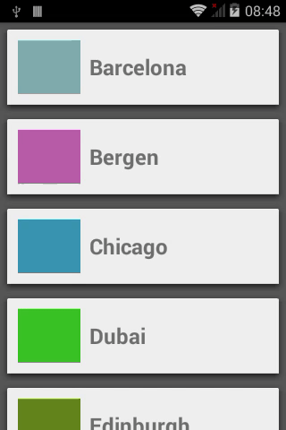

# ExpandLayoutManager for RecyclerView
======================

## Examples

## Description

To use this LayoutManager copy files that contains in com.azoft.layoutmanager folder and use this code:

	<dimen name="height_item">100dp</dimen>
	
	final int itemSize = ...;
    final ExpandLayoutManager layoutManager = new ExpandLayoutManager(itemSize);
	final RecyclerView recyclerView = (RecyclerView) findViewById(R.id.recycler_view);
	recyclerView.setLayoutManager(layoutManager);
	
To open/close item description add ItemClickListener and call method:
    	
	mLayoutManager.actionItem(mCurrentPosition);

For custom animation item  need implemented AnimationView:

  public interface AnimationView {
  
    void openAnimation();

    void closeAnimation();
  }
	
Full code from this sample:

	private int mCurrentPosition;
	private ExpandLayoutManager mLayoutManager;
	
	...
    // vertical layout
	mLayoutManager = new ExpandLayoutManager(getResources().getDimensionPixelSize(R.dimen.height_item));
	final RecyclerView recyclerView = (RecyclerView) findViewById(R.id.recycler_view);
	recyclerView.setLayoutManager(mLayoutManager);
	
    final DataAdapter dataAdapter = new DataAdapter(citiesResponse.getCities());
    recyclerView.setAdapter(dataAdapter);
    dataAdapter.setItemClickListener(new DataAdapter.OnItemClickListener() {
            @Override
            public void onItemClicked(final int pos) {
                mCurrentPosition = pos;
                mLayoutManager.actionItem(mCurrentPosition);
            }
        });
	}
	...
	
	@Override
    public void onBackPressed() {
        if (null == mLayoutManager || !mLayoutManager.isOpen()) {
            super.onBackPressed();
        } else {
			//closing description if need it
            mLayoutManager.closeItem(mCurrentPosition);
        }
    }

#### Contact ####

Feel free to get in touch.

    Website:    http://www.azoft.com
    Twitter:    @azoft
    LinkedIn:   https://www.linkedin.com/company/azoft
    Facebook:   https://www.facebook.com/azoft.company
    Email:      android-mobile@azoft.com

#### License ####

    Licensed under the Apache License, Version 2.0 (the "License");
    you may not use this file except in compliance with the License.
    You may obtain a copy of the License at

       http://www.apache.org/licenses/LICENSE-2.0

    Unless required by applicable law or agreed to in writing, software
    distributed under the License is distributed on an "AS IS" BASIS,
    WITHOUT WARRANTIES OR CONDITIONS OF ANY KIND, either express or implied.
    See the License for the specific language governing permissions and
    limitations under the License.
